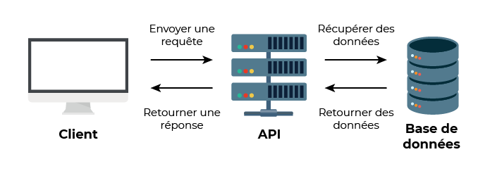

# 13. Laravel

## 09/07/2024

### Décourverte des notions

* API : APPLICATION PROGRAMMING INTERFACE, mise a jour dynamique des pages, la page dialogue avec le serveur sans actualiser la page, souvent retour en JSON.

* API def : mécanismes qui permettent à deux composants logiciels de communiquer entre eux à l'aide d'un ensemble de définitions et de protocoles

* HTTP : client -> GET(envoie), seveur -> POST(creation), PUT(modif), DELETE(supp).

* Ressource : ligne dans une table de bdd.

* REST : dialogue avec des bibliotheque en get pour recuperer des infos sous format qlqc/qlqc/qlqc en norme rest. le reste peu faire des requetes all ou single mais pas d'entre 2.

* design partern : solutions qui vide a regler un probleme récurrent dans la conception d'application

* MVC : MODELE VUE CONTROLLER, structure d'application simple et efficaces, 

* modele : ce charge de la logique métier, remplace le sql et ce charge la gestion des données mais aussi tout le code qui prend des décisions autour de ces données, on va donc apeller des methode de notre modele au lieu de requetes sql. On y trouve donc entre autres des algorithmes complexes et des requêtes SQL.

* vue : c'est tout ce qui concerne l'interface graphique, ce charge d'afficher les donnée renvoyer par le controlleur.

* controlleur : c'est lendroits ou va ce trouver la logique du logiciel, fait le pont entre le modele et la vue, composer de differente partie nommer action, possibilité de matcher une url avec un controlleur et une action precise : 
httpls://monsite.come/controlleur/action

_-_fr.png)

* routeur : 

