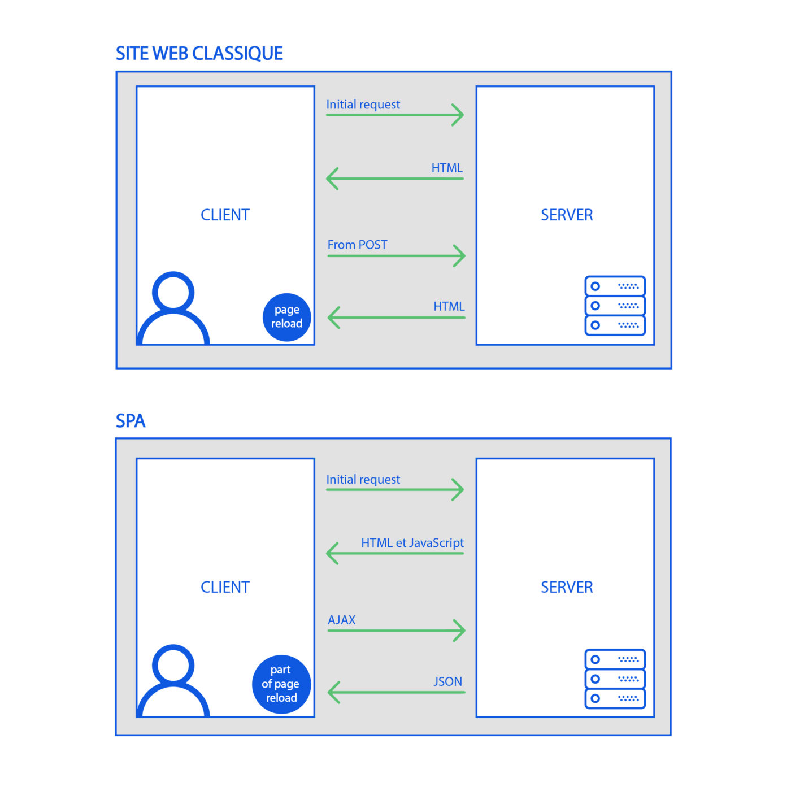

# SPA
## 26/08/2024
### ETAPE 1 : ES6

#### les variables

* var : declare une variable globale, on essaye de l'eviter au max

* let : declare une variable dons la porter est limité au bloc

* const : déclare une variable dont la valeur est constante

#### les functions

1. normal function : 
```
function functionName(parametre){ executable }
```

2. arrow function :
```
const functionName = (parametre) => { executable }
```

3. arrow function in object :
```
functionName: function(parametre) { executable }
```

#### Destructuring

* permet de destructurer un objet en fonction de ces clefs

* la syntaxe :
```
function functionName({ObjKeyRecup = DefaultValeur,ObjKeyRecup = DefaultValeur}){

}
functionName(ObjectRecup)
```

* la syntaxe {...variable} permet de definir un rest a recupere exemple :
```
const [a, b, ...otherNumber] = [1, 2, 3, 4];
console.log(otherNumber);
// outpout : 3, 4
```

#### import / export

* permet d'importer des fonctionnalité déja produite et mise a disposition dans notre code 
* permet d'exporter des fonctionnalité de notre code pour les utiliser ailleurs

exemple : 

```
import {hello} from './functions.js';
hello();

export {sum, sub, multiply, divide, pow}; // in math.js //
import {sum, sub, multiply, divide, pow} from './math.js'; 

import {default as def} from './functions.js';
```

#### Promises
##### 1 : les bases des promises

* L'objet Promise est utilisé pour réaliser des traitements de façon asynchrone. Une promesse représente une valeur qui peut être disponible maintenant, dans le futur voire jamais

* .then() est utiliser pour chainer plusieur promesse ensemble et lancer la function en parametre de then si la promesse precedente a un retour favorable

* .catch() est utiliser pour chainer plusieur promesse mais s'execute uniquement en cas de rejet dans la chaine de promesse

##### 2 : API fectch 

* on peu utiliser les promesses lors de requetes a une API pour grouper et executer parralelement ces requetes 

```
async function AllPeopleBySpecies() {
  let demande = await prompt("donne moi un numero de race");

  const reponse = await fetch("https://swapi.dev/api/species/"+demande);
  const species = await reponse.json();

  const tabPeoples = await species.people

  const test = await Promise.all(tabPeoples.map(tabPeople => {
    return fetch(tabPeople);
  }));
  const test2 = await Promise.all(test.map(tes => {
    return tes.json();
  }));

  console.log(test2)
}
```

##### 3 : DOM

* on peu utiliser les promesses avec des elements du DOM, dans l'exemple si dessous on a 2 boutons (ok et cancel), qui retourne les valeur de resolvie ou de rejet l'ors du click sur l'un des 2, on utilise le retour de la promesse pour afficher (ok ou cancel) dans la console

```
async function PromiseBtn() {
  return new Promise(function(myResolve, myReject){
    document.querySelector('.BtnOk').onclick = function(){return myResolve("Ok clicked")}
    document.querySelector('.BtnCancel').onclick = function(){return myReject("Cancel clicked")} 
  });
}

PromiseBtn().then(
  function(value){console.log(value)},
  function(error){console.log(error)}
)
```

#### Await/Async

* Synchrone = se passe en même temps.

* Asynchrone = ne se passe pas en même temps

1. Await : Le mot-clé await fait en sorte que JavaScript attende que cette promesse se réalise et renvoie son résultat. await suspend littéralement l’exécution de la fonction jusqu’à ce que la promesse soit réglée.C’est juste une syntaxe plus élégante pour obtenir le résultat de la promesse que promise.then. Et c’est plus facile à lire et à écrire.

2. Async : Le mot “async” devant une fonction signifie une chose simple : une fonction renvoie toujours une promesse.

### Etape 2 : Node.js

* Node.js est un language utilisé pour écrire des services côté serveur appelés API Et au final, on peut dire que Node.js représente une alternative à des langages serveur comme PHP, Java ou Python.

### Etape 3 : SPA - Vue.js

* SPA
    1. question ?
    * Quand et pourquoi ce type d'applications a vu le jour ?
    * Quels sont les avantages et inconvénients de cette approche ?
    * Quels sont les principaux frameworks utilisés pour développer des "SPA" de nos jours ? 

    2. reponse
    * le terme a été introduit en 2005
    * l'avantage majeur est de fluidifier l'experience utilisateur en evitant le chargement complet de nouvelle page lors d'action et de ne charger que des bout de page en modifiant leurs donnée / probleme de SEO et beaucoup plus coûteuses a cree
    * ANGULAR / REACT / EMBER / VUE

Shema simplifier SPA



|   Framework   |   Date de création   |   Communauté |   License  |   Points forts   |   Points faibles  |
|---            |:-:                     |:-:           |:-:        |:-:                |:-:                 |
|   ANGULAR     |   14 septembre 2016    |   Google     |   MIT     |   Flexibilité,Modularité,composants réutilisables,Communauté active,Communauté active   | framework complexe,très structurée,constante évolution |
|   REACT       |   29 mai 2013    | Meta Platforms |   MIT |   open source,mature, mobile facile,   |  Difficulté a gerer des gros volume de donnée, difficile d'aprentissage  |
|   EMBER       |   8 December 2011   |   Ember Core Team |   MIT |   Le framework offre un rendu côté serveur,Documentation abstraite,Opportunités de développement full-stack,Configuration facile,Performance haut de gamme,Hautement cohérent ,Routeur intégré,Aide à la liaison des données dans les deux sens  |  Payant  |
|   VUE     |   June 28, 2024   |   Evan You and the Core Team  |   MIT |   Flexibilité,Légèreté,Rapidité,Une courbe d’apprentissage aisée,Une vaste communauté indirecte,syntaxe performante,Polyvalence   |   stabilité hasardeuse,évolutivité perfectible,communauté restreinte  |

#### creation projet vue

Lors de la creation d'un nouveau projet vue ( avec la commande : `npm init vue@latest` ) on retrouve tout un tas de fichier et dossier qui sont crée :

* package.json et package-lock.json ou l'on retrouve les infos et les dependences neccesaire au bon fonctionnement du projet
* index.html qui est le contenue html de la page d'acceuil
* gitignore avec tout les fichiers que git ne doit pas lire déja configurer
* main.js qui a la fonction d'importer l'Application et de la créeS
*  App.vue qui est la page principale qui va appeler nos different composant pour les afficher
* le Dossier view et composant ou sont stocker nos pages ou partie de pages
* le Dossier routeur ou ce trouve nos routes
* Asset ou on retrouve nos style css et des logo, img
* Node module ou l'on retrouve tout les module node importer pour vue 

#### Laravel
Serveur web | Navigateur web
:-: | :-:
 Stocker les données de l’application   | Effectuer le rendu des pages web
Router les requêtes HTTP | Afficher les pages web
Exécuter le code métier de l’application | ///////

#### Vue.js
Serveur web | Navigateur web
:-: | :-:
 Router les requêtes HTTP   | Stocker les données de l’application
Effectuer le rendu des pages web | Afficher les pages web
////// | Exécuter le code métier de l’application


* pour sécuriser les applications Vue et eviter les injection de script, Vue m'est en place un systeme d'echappée automatique ( Hash ) exemple

```
<script>alert("hi")</script>
```
devient
```
&lt;script&gt;alert(&quot;hi&quot;)&lt;/script&gt;
```