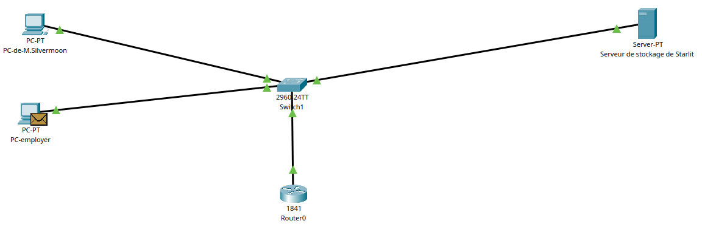
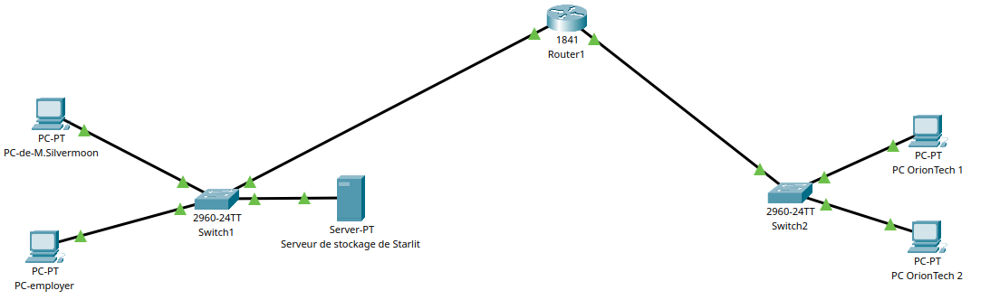

# Déploiment
## 10/09/2024
### etape 1 : Modele OSI

* Pour vous, qu’est ce qu’un réseau ? 
    * pour moi c'est un esemble de machine ( ordinateur ou serveur ) qui communique entre elle et echange des infos

* Quel est le lien entre la notion de réseau et Internet?
    * la difference entre les 2 c'est la porter ! le reseaux connecter des machine localement alors qu'internet connecte des machine mondialement

* Quelle est la différence entre Internet et le Web ? Ou a-t-il été inventé ?
    * internet permet une commmunication d'un ordinateur a un autre, le web quand a lui est un moyer de visiter des page a partire d'un navigateur
    * internet est inventer dans les années 60 de son ancètre Arpanet developpé par l'armée americaine quand au web est inventé en 1989 par Tim Berners-Lee, physicien au CERN

* Quels sont les différents types de réseaux informatiques ?
    * PAN : Personal Area Network / réseaux local
        * permet d’échanger des données entre des appareils proches (généralement dans la même pièce) utilise souvent le bluthooth ou l'usb sans fil
    * LAN : Local Area Network / Réseaux local
        * permet de reliée plusieur ordinateur ( souvent par ethernet ) sur un reseau local
    * MAN : Metropolitan Area Network / réseau métropolitain
        * permet de reliée plusieur lan proche en utilisant la fibre ou de puissant routeur il permet souvent de reliées plusieur branche d'une sociéte
    * WAN : Wide Area Network  / Reseau etendue
        *  permet de relier différentes machines très éloignées (à l’échelle d’un continent) utilise les adresse ip, de SDH, ou ATM
    * GAN : Global Area Network / Reseau global
        * internet est un GAN, un reseau mondial, mais aussi certaine entreprise utilise des GAN pour connecter entre eux different WAN utilise des cables sous-marin ou le reseaux satellite

* ping google.com
    * j'observe le nombre de byte reçu suivie de l'adresse d'envoie ( version ip et version adresse internet) , un chiffre de sequence icmp, le time to live des données et le temps de reponse ne ms

* ping 192.0.2.255
    * j'observe que j'ai pas de reponse ou alors très longue

* ping 172.217.20.174
    * j'observe la même chose que la 1ère commande sauf que cette fois si ce n'est pas une adresse venant d'internet dans dans la provenance de la reponse je vois selement l'adresse IP

#### exercice Cisco

* Quelles sont les machines / types de machines qui vont intervenir dans ce réseau
    1. Ordinateur personnel de M. Silvermoon (poste client).
    2. Serveur de stockage situé dans le local de StarLit.
    3. Routeur pour assurer la communication entre différents réseaux (si StarLit se connecte à l’extérieur).
    4. Switch pour connecter plusieurs appareils au sein du même réseau local (LAN).
    5. Firewall (optionnel) pour protéger le réseau.

* Quel type de support de communication choisir .
    1. Câble cuivre (Ethernet) : adapté pour des distances courtes, 
    2. Fibre optique : coûteuse, mais offre des débits beaucoup plus élevés (jusqu’à plusieurs Tbps) et permet des transmissions sur de longues distances avec une très faible latence.
    3. Sans-fil (Wi-Fi) : pratique pour la mobilité, mais les débits sont plus faibles et sensibles aux interférences

* Comment les machines sont identifiées au sein d’un réseau ?
    1. Adresse MAC : unique à chaque interface réseau, elle identifie physiquement une machine dans le réseau local
    2. Adresse IP : identifie logiquement chaque machine dans un réseau IP, permettant de les localiser sur Internet ou dans un réseau local

* Qu’est-ce qu’une interface réseau ?
    1. Une interface réseau est un point de connexion entre une machine et un réseau. Elle peut être :
        * Physique : un port Ethernet, un adaptateur Wi-Fi, etc.
        * Virtuelle : utilisée dans les machines virtuelles
        * VLAN (réseaux locaux virtuels).

* Qu’est-ce qu’une adresse MAC ?
    * (Media Access Control) est une adresse physique unique à chaque interface réseau gravée dans le matériel (la carte réseau)

* Qu’est-ce qu’une adresse IP ? Comment peut-on la paramétrer ?
    * (Internet Protocol) est une adresse logique qui identifie un appareil au sein d'un réseau IP. Il existe deux versions d’adresses IP 
        1. IPv4 (comme 192.168.1.1) : utilise des adresses de 32 bits.
        2. IPv6 (comme 2001:0db8:85a3::8a2e:0370:7334) : utilise des adresses de 128 bits.
    * La configuration peut se faire de deux manières :
        1. Statique : L’adresse IP est assignée manuellement à chaque appareil.
        2. Dynamique (via DHCP) : L’adresse IP est automatiquement assignée par un serveur DHCP (Dynamic Host Configuration Protocol).

* Comment tester la bonne configuration et la communication entre deux machines ? 
    * Commande ping : Envoie des paquets vers l'adresse IP cible et mesure le temps de réponse
    * Commande traceroute (ou tracert sous Windows) : Montre le chemin suivi par les paquets pour atteindre une adresse IP spécifique

le masque de l'adresse 192.168.1.0 est l'adresse réseau de 2 réseaux différents : celui avec le masque de classe C ( 255.255.255.0 ) et celui avec le masque complet après découpage en sous-réseaux ( 255.255.255.224 ).

L'adresse de broadcast est une adresse IP qui termine en . 255 dans des réseaux de classe A, B ou C, cette adresse est celle qui permet de faire de la diffusion à TOUTE les machines du réseau

* 192.168.1.1/24 et 192.168.24.3/24 
    * sont-elle sur le même reseaux ? 
        * non
    
    * Quelles sont les adresses réseaux respectives ?
        1. L'adresse du sous-réseau :	192.168.1.0
        2. L'adresse du sous-réseau :	192.168.24.0

* le modèle Osi et ces differentes couche :
    1. Couche physique : fait references a toutes les caracteristique electrique et physique des apareils
    2. Couche réseau : 

### etape 2 : Service DNS

### etape 3 : Protocole HTTP

### etape 4 : connexion SSH

### etape 5 : deploiment sans contenaire

### etape 6 : initiation a Docker