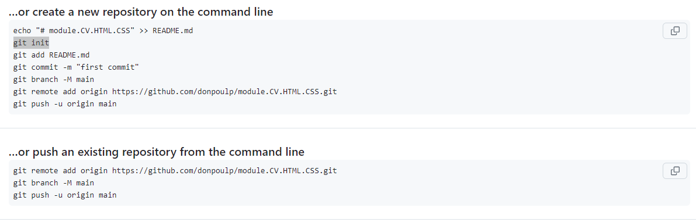

# Commande git

### travail en equipe main + branche, comment push :

commencer par verifier que ma banche est a jour par apport au main 

git stash

git pull “origin” “main” ou “ma branche”

git stash pop →→ résolution de confllie

git add *

git commit -m “mon commit”

git push “origin” ‘ma branhe”

mettre a jour le main par apport a ma branche !

git checkout main

git merge “ma branche” →→ résolution de confllie

git checkout “ma branche”

git pull “origin” “main”

## 29/05/2024 Debut module GIT

### Etape 1