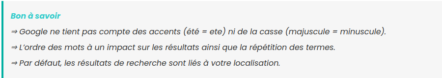
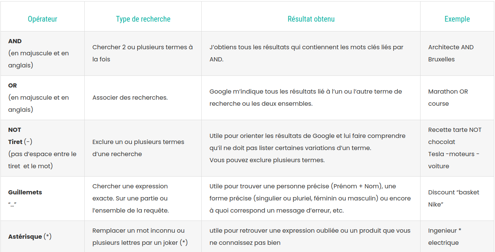
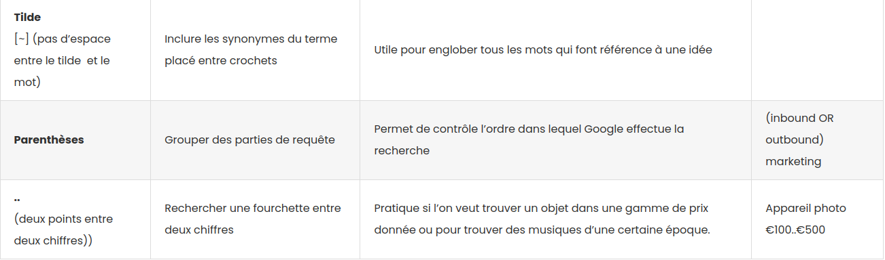
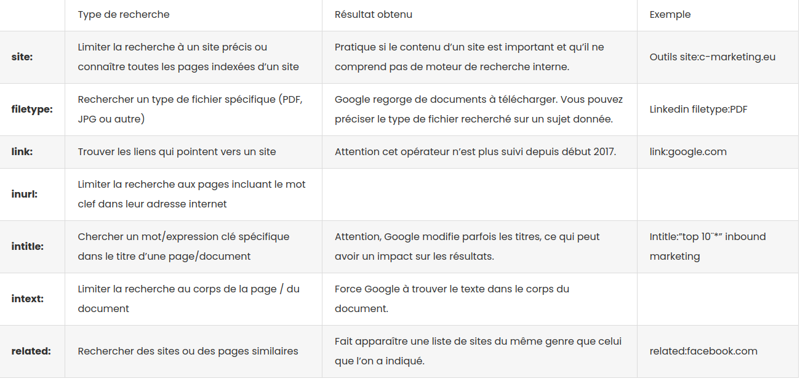

# CULTURE NUMERIQUE

## 04/06/2024

### Etape 1 : Apprendre à rechercher sur Google

* Conseil n° 1 : Commencez par une recherche simple
* Conseil n° 2 : Lancez une recherche vocale
* Conseil n° 3 : Utilisez des mots adaptés au Web
* Conseil n° 4 : Ne vous souciez pas des détails
* Conseil n° 5 : Découvrez les réponses rapides!

#### bon a savoir

#### OPERATEUR GOOGLE

#### FILTRE GOOGLE

### Etape 2 : Site ressource for Dev
* [W3School](https://www.w3schools.com/) La plateforme fournit des tutoriels et ressources pour apprendre les langages et technologies élémentaires. 
* [OpenClasserom](https://openclassrooms.com/fr/) La plateforme fournit des tutoriels et ressources pour apprendre les langages et technologies élémentaires. 
* [CodeAcademy](https://www.codecademy.com/) une plateforme d’apprentissage en ligne qui propose des formations sur divers sujets liés à la programmation
* [GrafikArt](https://grafikart.fr/) Grafikart produit chaque année une quantité astronomique de contenus vidéos, organisés au sein de playlists, qu’il adapte ensuite sur son site web.
* [LaConsole](https://laconsole.dev/) LaConsole est une plateforme d’elearning entièrement gratuite, sur laquelle il est possible de se former au développement web sous tous ses angles : frontend, backend et no-code.
* [StackOverflow](https://stackoverflow.com/) Stack Overflow est une communauté de questions-réponses florissante où vous pouvez trouver des solutions aux problèmes de codage
* [MDN Web Docs](https://developer.mozilla.org/fr/) MDN Web Docs de Mozilla est un « trésor » de documentation approfondie sur le développement Web

