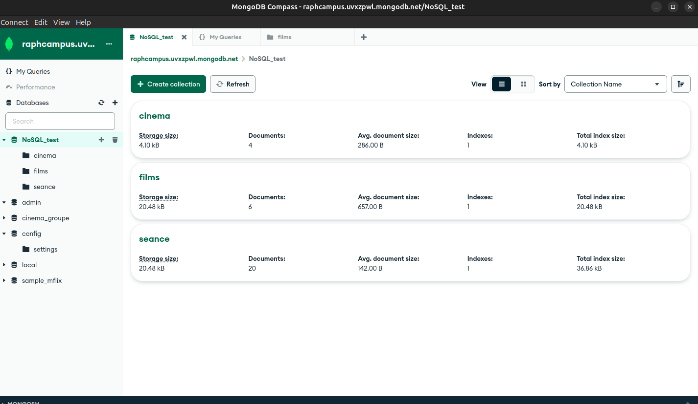

# 8. BDD

## 10/06/2024

### etape 1 découvrire le concept de BDD

Shema simple BDD:

Définir les concepts de base/tables/champs/données/relations :

* base : Ensemble de table qui donne le contenue de notre base de donnée

* tables : Ensemble de champs qui constitue nos tables

* clefs : Clef pimaire ou etrangere, serve a mettre en relaion 2 base de données en fesant apelle l'une a l'autre

* index : C'est une donnée de structuration pour permettre de trouver + rapidement les donnée

* champs : C'est l'etiquette qu'on pose sur nos donnée ou une donnée d'un enregistrement

* enregistrement : Ou ligne qui contient different champs

* données : Valeur (int, string, float, boolean) que l'on entre dans nos champs

* relations : on parle de relation entre nos tables ou nos bases quand 2 d'entre elle communique l'une et l'autre entre leurs données a l'aide de cléf primaire ou secondaire

## 13/06/2024

### etape 2 : SQL

1. Utilisation de Mysql-Workbench pour modeliser la structure de table/table de laisons qui vons constituer notre BDD

modelisation bdd : 

2. remplire les tables de notre bdd avec les données donner par les livrables : requetes d'insertion : 

3. executer quelques requetes simples : 

4. INNER JOIN

5. 4 dernière requete un peu plus complexe

## 14/06/2024 + 15/06/2024

### etape 3 : NOSQL

Plusieur type de NOSQL existe mangodb, redis etc... a l'inverse de SQL qui respect tout les principe ACID, NOSQL va oublier un des principe ACID pour mieu ce concentrer sur les autres et être plus perfomant dans celle-ci, ce n'est pas tout le temps utile mais peu s'avérer + performans pour certains cas.

1. reformatage des données : on va retravailler nos table, il n'y a plus de jointure donc il faut imbriquer les tables entre elle et suprimer les clef etrangère. 

EXEMPLES : 

2. Utilisation de mangoDB : table = collection
en mangoDB on utilise du JSON plutot que du sql pour travailler avec un format clef : valeurs exemple : 

3. requetes mangodb : 
    - 'database'.'collection'.'fonction de recherche'({ 'clef' : 'valeur'})
    - NoSQL_test.films.find({ title : "Apocalypse Now" })
    - et sur mango DB : { title : "Apocalypse Now" }

4. j'ai tester 2 façon differente de me conecter en local a ma bdd mangoDB.
    1. compass : 
    2. extensions mongodb for vscode : 