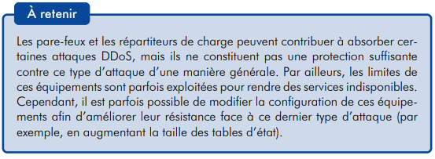
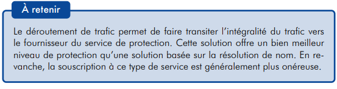

# 9. La cyber-sécurité

## 19/06/2024 matin

### étape 1 : decouverte et glossaire

* La cybersécurité est la pratique consistant à protéger les systèmes, les réseaux et les programmes contre les attaques numériques.

* Les different type de sécurité :
    1. Sécurité des infrastructures critiques : c'est la sécurité des infrastructure qui permet a une enreprise de fonctionner
    2. Sécurité des réseaux : empêche l’accès non autorisé aux ressources réseau, et elle permet de détecter et arrêter les cyberattaques et les violations de sécurité réseau en cours
    3. Sécurité au Point de terminaison : (serveurs, ordinateurs de bureau, ordinateurs portables, appareils mobiles) restent le principal point d’entrée des cyberattaques
    4. Sécurité des applications : La sécurité des applications protège les applications exécutées sur site et dans le cloud
    5. Sécurité cloud : La sécurité du cloud protège les actifs et services cloud des organisations 
    6. Sécurité des informations : concerne la protection de toutes les informations importantes d'une organisation (fichiers et données numériques, documents papier, supports physiques, et même interventions humaines) contre l'accès, la divulgation, l'utilisation ou l'altération non autorisés.
    7. Sécurité mobile : englobe diverses disciplines et technologies propres aux smartphones

* Les different type d'attaque :
    1. Malwares :  sont des codes logiciels ou des programmes informatiques conçus intentionnellement pour nuire à un système informatique ou à ses utilisateurs.
    2. Ransomware : Malwares qui recupère les donnée de l'utilisateur pour lui demander une rançon.
    3. Phishing : Les attaques par hameçonnage sont des e-mails, des SMS ou des messages vocaux qui incitent les utilisateurs à télécharger des logiciels malveillants, à partager des informations sensibles ou à envoyer des fonds à des personnes malveillantes
    4. Menaces internes : Les menaces internes sont des menaces qui proviennent d’utilisateurs autorisés, c’est-à-dire d’employés, de sous-traitants ou de partenaires commerciaux, qui abusent, intentionnellement ou non, de leur accès légitime, ou dont les comptes sont détournés par des cybercriminels
    5. DDoS : Une attaque DDoS tente de faire tomber en panne un serveur, un site web ou un réseau en le surchargeant de trafic,

* Les bonne pratique :
    1. crée des mdp bien sécuriser (au minimum 10 carac avec chiffre + lettre + 1 carac speciale + 1 maj)
    2. Ne pas reutiliser tout le temps le même mots de passe, utiliser un gestionnaire de mots de passe pour les stocker.
    3. L'importance des mise a jour : Leur rôle étant d’ajouter des fonctionnalités, de corriger les failles de sécurité présentes sur les systèmes
    4. Le controle d'accès : c'est le principe de limité et selectionner qui à accès a quoi, exemple : qui a acces au back office ou qui a les droits admin et pour cb de temps ? ou même physiquement, qui a accès a nos serveur ou au pc
    5. Le moindre privilège : Le principe du moindre privilège, également appelé « accès au moindre privilège », est le concept selon lequel un utilisateur ne doit avoir accès qu'à ce dont il a absolument besoin pour exercer ses responsabilités, et pas plus.
    6. 2FA : Ajoute une 2ème authentification autre que le mots de passe, souvent la 2ème authentification est physique pour retrouver un mots de passe + une application qui permet d'autoriser l'acces. 

## 19/06/2024 après midi

### etape 2 : Analyse d’attaques courantes et contre mesures
* . DDOS
    1. Filtrage en bordure du réseau de lʼentité : les types d’équipement permettant d’effectuer du filtrage en bordure du réseau d’une entité
    2.  Équipements de type pare-feu : contribuer à absorber certaines attaques DDoS, par exemple celles générant un trafic relativement faible
    
    3. Recours à des équipements spécifiques : Ces équipements possèdent, en général, des capacités de traitement adaptées, et offrent plusieurs types de contre-mesures :
        * effectuer du filtrage basé sur la position géographique des sources
        * définir des règles précises pour filtrer des paquets sur leur contenu
        * limiter le nombre de requêtes dans un intervalle de temps donné pour des ressources particulières
        * de définir des seuils de détection d’attaque en fonction de paramètres comme la bande passante
    
    4. Protection offerte par les hébergeurs : Différents niveaux de protection sont souvent proposés, une protection par défaut étant parfois incluse dans les offres d’hébergement. Dans ce dernier cas, il convient de s’assurer du niveau de protection offert.
    
    5. Filtrage par lʼopérateur de transit : aider à contrecarrer partiellement ou totalement les effets d’une attaque DDoS
    
    6. Filtrage au niveau du réseau de lʼopérateur de transit : L’opérateur de transit peut mettre en place un filtrage du trafic basé sur les adresses IP source ou destination
    7. Service de filtrage spécifique aux attaques DDoS : Dans la pratique, deux modes d’opérations principaux peuvent être rencontrés :
        * le service est géré par l’opérateur
        * il peut s’agir d’une plate-forme mise à disposition par l’opérateur
    
    8. Recours à un Content Delivery Network :  est une infrastructure de serveurs répartie dans plusieurs data centres, et dont l’objectif est de se substituer aux services d’une entité pour servir ses contenus au plus proche des utilisateurs
    
    9. Services de protection dédiés : En dehors des hébergeurs, des sociétés offrent un service de protection contre les attaques DDoS dit « dans le cloud ».
    10.  Redirection via le protocole DNS : Certains services de protection reposent sur une redirection DNS. Le but est de diriger le trafic à destination d’un domaine, comme example.com, vers l’adresse IP d’un serveur du fournisseur de protection
    
    
    11.  Déroutement du trafic par des annonces BGP : L’objectif de cette méthode est de diriger l’ensemble du trafic à destination d’un bloc d’adresses IP vers le fournisseur de service de protection
    
    
    12. Autres mesures techniques et organisationnelles : 
        * la segmentation du réseau de l’entité de manière à faciliter le filtrage en cas d’attaque, et l’isolement éventuel de certains sous-réseaux ou de certains serveurs
        * la mise en œuvre d’un filtrage à la bordure du réseau de l’entité afin de n’autoriser que les flux nécessaires au fonctionnement de cette dernière
    
    13. Services fournis par des entités externes :  
    
* man-in-the-middle ( MITM )
    1. Usurpation d'adresse IP : En usurpant une adresse IP, un attaquant peut vous faire croire que vous interagissez avec un site Web ou avec quelqu'un que vous n'êtes pas, en lui donnant peut-être accès à des informations que vous ne partageriez pas autrement
    2. Usurpation DNS : une technique qui force un utilisateur à accéder à un faux site Web plutôt qu'au site réel qu'il a l'intention de visiter
    3. Usurpation HTTPS : voir « HTTPS » dans l'URL, plutôt que « HTTP », est un signe que le site Web est sécurisé et fiable. En fait, le « S » signifie « sécurisé »
    4. Détournement SSL : Lors d'un détournement SSL, l'attaquant utilise un autre ordinateur et un serveur sécurisé et intercepte toutes les informations transitant entre le serveur et l'ordinateur de l'utilisateur.
    5. Détournement d'e-mails : Les cybercriminels ciblent parfois les comptes de messagerie des banques et autres institutions financières. Une fois qu'ils y ont accès, ils peuvent surveiller les transactions entre l'institution et ses clients
    6. Écoutes Wi-Fi : Les cybercriminels peuvent établir des connexions Wi-Fi avec des noms à consonance très légitime, semblables à ceux d'une entreprise à proximité.
    7. Voler les cookies du navigateur : Un cybercriminel peut détourner ces cookies de navigateur. Étant donné que les cookies stockent les informations de votre session de navigation
* man-in-the-middle ( MITM ) contre mesure
    1. Assurez-vous que « HTTPS » – avec le S 
    2. Méfiez-vous des e-mails de phishing potentiels
    3. Ne vous connectez jamais directement aux routeurs Wi-Fi publics
    4. vous devez installer une solution de sécurité Internet complète, telle que Norton Security, sur votre ordinateur
    5. Assurez-vous que votre réseau Wi-Fi domestique est sécurisé
* SQL INJECTION
    1. Les attaquants peuvent utiliser l'injection SQL sur une application si celle-ci contient des requêtes de base de données dynamiques qui utilisent la concaténation de chaînes et les entrées fournies par l'utilisateur
    2. Arrêtez d'écrire des requêtes dynamiques avec concaténation de chaînes ou
    3. Empêchez l'inclusion d'entrées SQL malveillantes dans les requêtes exécutées.
    4. Option 1 : utilisation d'instructions préparées (avec requêtes paramétrées)
    5. Option 2 : utilisation de procédures stockées correctement construites
    6. Option 3 : Validation des entrées de la liste verte
* XSS
    1. sont un type d'injection dans lequel des scripts malveillants sont injectés dans des sites Web
    2. c'est quand t'envoie un script coté navigateur au travers des different input su site en question
    3. Les attaques Cross-Site Scripting (XSS) se produisent lorsque :
        * Les données entrent dans une application Web via une source non fiable, le plus souvent une requête Web.
        * Les données sont incluses dans un contenu dynamique envoyé à un utilisateur Web sans être validées pour le contenu malveillant.
    4. Pour qu'une attaque XSS réussisse, un attaquant doit être capable d'insérer et d'exécuter du contenu malveillant dans une page Web. Ainsi, toutes les variables d'une application Web doivent être protégées. S'assurer que toutes les variables passent par la validation et sont ensuite échappées ou nettoyées est connu sous le nom de résistance parfaite à l'injection 
    

